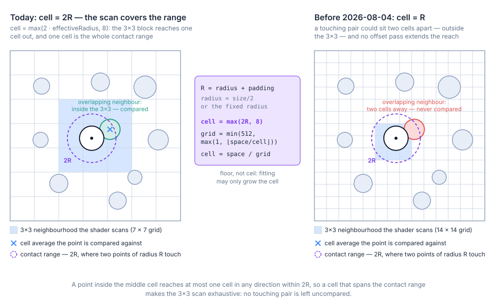
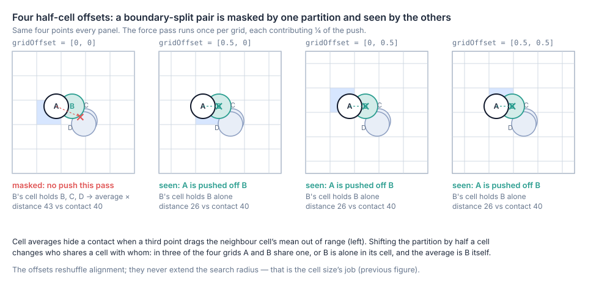
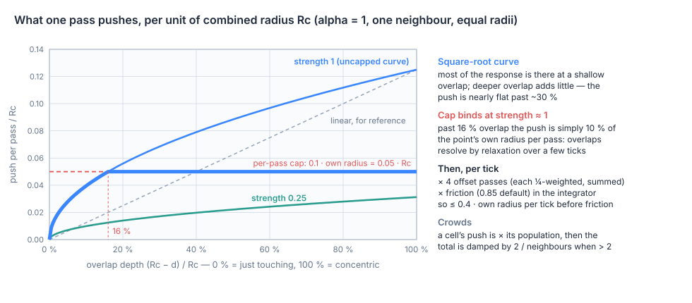
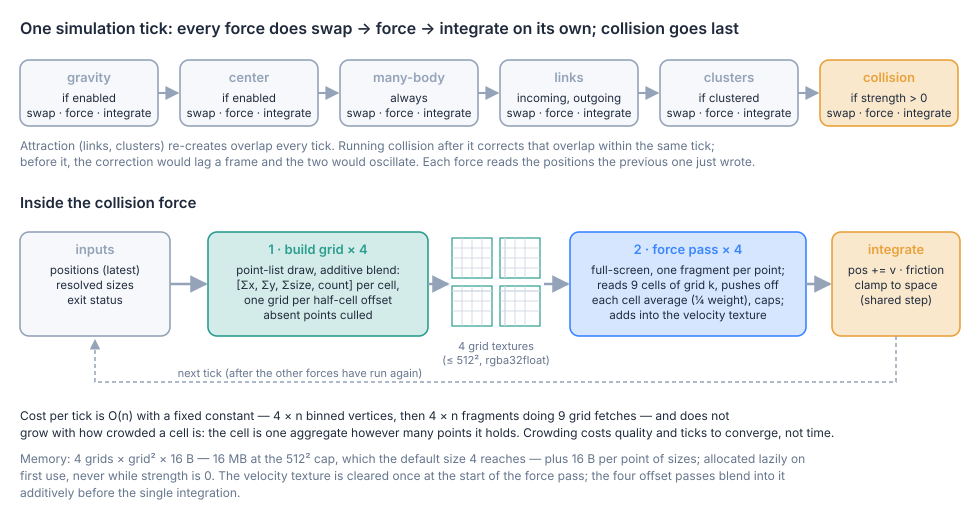

# The collision force: a spatial-hash grid with cell-average contact resolution

This is a walkthrough of the collision force — what it does, how it stays linear-time on
the GPU, and what its approximation costs. It was added in
`feat(simulation): add spatial-hash point collision force` (`68492a9`) and made correct at
every point size in `fix(force): cover the full collision range and unbias cell averages`
(`ca4ee44`) and `fix(force): keep the fitted collision cell at the interaction range`
(`58e2475`). The code lives in `src/modules/ForceCollision/`; the short engineering record is
`history/2026/2026-06-13-collision-force.md`.

The force is driven by three config keys (interface in `src/config.ts`, defaults in
`src/variables.ts`):

| Property | Meaning | Default |
|---|---|---|
| `simulationCollision` | Strength. `0` disables the force and allocates nothing. | `0` |
| `simulationCollisionRadius` | A fixed collision radius for every point. `0` or `undefined` derive it per point as `size / 2`. | `undefined` |
| `simulationCollisionPadding` | Extra room added to every radius, in space units, so neighbours settle `2 × padding` apart instead of touching. | `0` |

Throughout, **R** means a point's *effective radius*: the fixed radius or half its size, plus
the padding.

## The problem this force solves

The many-body force repels point *centers* with an inverse-distance falloff. It has no idea
how big a point is drawn, so when size carries meaning — degree, a metric, importance — the
biggest points are exactly the ones that end up stacked on each other, illegible and
un-hoverable. What is missing is a **contact force**: one that acts only while two discs
interpenetrate, pushes them apart along the line between their centers, and vanishes the
moment they touch. That is `d3-force`'s `forceCollide`, and cosmos.gl's layout was modeled on
`d3-force`.

Contact is a pairwise question, so computed literally it is n² tests per tick. `d3-force`
avoids that with a quadtree rebuilt on the CPU every tick; cosmos.gl cannot — the whole
simulation has to stay on the GPU at hundreds of thousands of points, and there is no
readback in the loop. The task is to answer "who is touching me?" for every point in a fixed
number of texture reads.

## The idea in one sentence

Bin every point into a uniform grid whose cell spans the whole contact range, so that each
point's 3×3 cell neighbourhood is guaranteed to contain every point it can touch; then let
the point react to the **average** of the other points in each of those nine cells, as if the
cell were one disc of averaged size and position — and do that four times on half-cell-shifted
grids so that a contact split by a cell boundary is caught by one of them.

Three ideas, one per step below: the cell size, the four offset grids, the averaged contact.

### Step 1 — size the cell to the contact range



`create()` in `src/modules/ForceCollision/index.ts` sizes the grid from the physics, not from
the point count:

```
R    = (fixed radius > 0 ? fixed radius : maxSize / 2) + padding   // largest R in the graph
cell = max(2 · R, 8)
grid = min(512, max(1, ⌊spaceSize / cell⌋))                         // cells per axis
cell = spaceSize / grid                                             // refit — only ever grows
```

The `2 · R` is the whole argument. Two points of the largest radius touch when their centers
are `2R` apart, and the force shader scans only the 3×3 block around a point's own cell — one
cell of separation in each axis. A point inside the middle cell reaches at most one cell in
any direction within a distance of one cell, so **if the cell is at least the contact range,
the 3×3 scan is exhaustive**: no touching pair can sit in cells that are never compared. If
the cell is smaller than that, a touching pair can be two cells apart and no amount of work
downstream can see it.

That is exactly the bug the August fixes closed. The original cell was one `R`, and an
8-unit floor hid it: at the default size of 4 (`R = 2`) the floor made the cell 8, which
happened to span the range, so collision looked fine in every default demo and quietly failed
for anything larger. Measured with collision as the only force, settled: 200 points at size
30 left 79 overlapping pairs, the worst interpenetrating by 24 % of a diameter; 40 points at
size 100 left 18 pairs. Both go to zero with the cell at `2R`. The second fix is why the
formula floors rather than ceils and allows a 1-cell grid: refitting the cell to a whole
number of grid cells had rounded the count *up*, which makes the cell slightly *smaller* than
requested, and a 32-cell minimum pinned the cell at `spaceSize / 32` however large the radius
grew — so above `R = 64` the gap reopened completely (30 points at size 300: 26 overlapping
pairs, now none). Rounding down means fitting can only grow the cell, and a large radius
legitimately wants a coarse grid; at one cell every point shares it and reacts to the average
of all the others, which is the degenerate but correct case where the contact range covers
the whole space.

Two consequences worth holding onto:

- **The grid is sized by the largest point, not by n.** This is the opposite of the many-body
  grid, whose finest level tracks `2·√n`. Bigger points ⇒ coarser grid ⇒ more points per
  cell ⇒ a coarser approximation (step 3). Small points at the default size run at the 512²
  cap: `spaceSize 4096 / cell 8 = 512`.
- **The size is a per-graph maximum.** In derived-radius mode, `create()` loops over every
  resolved point size (`getResolvedPointSize`, so a `NaN` "use the default" never poisons the
  maximum, and a spread into `Math.max` never throws on a 50k-element array). One huge point
  coarsens the grid for everybody; a fixed `simulationCollisionRadius` decouples the physics
  from the drawing when that matters.

### Step 2 — build the grid, four times

`build-grid.vert` / `build-grid.frag` draw every point as a 1-pixel point into the grid
texture with additive blending, so each cell accumulates `[Σx, Σy, Σsize, count]`. Absent
points (a `NaN` position, see `history/2026/2026-06-27-nan-point-removal.md`) are culled
here: a `NaN` bins to a `NaN` cell and would poison every sum it touched.

The draw runs **four times**, into four grid textures, each with the binning shifted by a
half cell: offsets `[0, 0]`, `[½, 0]`, `[0, ½]`, `[½, ½]`. The reason is not reach — the
offsets never extend the search radius, which step 1 already settled — but the averaging in
step 3:



A point never sees its neighbours individually, only each neighbouring cell's *mean*. When a
touching pair straddles a cell boundary, the neighbour is represented by the mean of its whole
cell, and a third point on the far side of that cell drags the mean out of contact range: the
overlap is real, and this grid cannot see it. Shifting the partition by half a cell changes who
shares a cell with whom. In the shifted grids the pair either lands in one cell — where the
own-cell average, after subtracting yourself, *is* the neighbour — or the neighbour is alone
in its cell, and again the average is exact. The force pass runs once per grid, each pass
weighted by ¼, so a contact that one partition averages away is still resolved by the other
three at ¾ strength instead of not at all.

### Step 3 — resolve against the cell averages

`force-collision-spatial.frag` is a full-screen pass, one fragment per point. For each of the
9 cells in the 3×3 block it reads one texel and does this:

```
count, Σpos, Σsize ← cell                         // own cell: subtract yourself first,
                                                  //   skip the cell if nobody else is in it
avgPos  = Σpos / count       avgR = (Σsize / count) / 2 + padding
Rc      = R_self + avgR                            // combined radius: contact distance
d       = |pos − avgPos|

if d < Rc:                                        // overlapping the averaged disc
  overlap = (Rc − d) / Rc                          // 0 = touching, 1 = concentric
  push    = alpha · strength · √overlap · Rc / 2 · ¼ · count
  push    = min(push, Rc / 2)                      // per-cell cap
  v      += push · (pos − avgPos) / d              // straight away from the average
```

The **self-subtraction** is the second half of the August fix. The point's own position and
size are in its own cell's sums; leaving them in drags the average toward the point and
halves the measured distance for a two-point cell, so every own-cell overlap was overstated.
Removing them first — and skipping the cell when it then holds nobody — makes the own-cell
average the mean of the *other* occupants, which is what the neighbour cells already were.

The **`count` factor** treats the cell as `count` discs stacked at the average — a crowded
cell pushes harder than a lone neighbour. That would blow up in a dense pile, so after the
loop two normalisations run:

```
if neighbours > 2:  v *= 2 / neighbours            // density damping: ≈ two neighbours' worth
|v| ≤ 0.1 · R_self                                 // per-pass cap
```

Together they mean the count weighting mostly *distributes* the push among the nine cells by
population, while the total stays bounded: a point in a crowd gets roughly two neighbours'
worth of push, aimed away from where the crowd is heaviest.



The **square-root curve** is concave: most of the response is already there at a shallow
overlap and deeper overlap adds little. Combined with the **per-pass cap of 10 % of the
point's own radius**, this is what turns overlap resolution into *relaxation*. At strength 1
with equal radii the cap binds at 16 % overlap — beyond that the point simply moves a tenth of
its radius per pass, up to 40 % of its radius per tick across the four passes, then times the
integrator's friction — so a deep pile unwinds over a few ticks instead of being flung apart
in one and ping-ponging back. Below 16 % the curve tapers the push to zero, so a pair settles
at contact instead of dithering across it. At low strength (the stress test uses 0.25) the cap
never binds and the curve alone shapes the push.

Two more guards, both born from real failure modes:

- **Coincident points get a deterministic fan-out.** If a point sits exactly on a cell's
  average (`d ≤ 0.001` — two points seeded at the same position, or a pile at one spot) there
  is no direction to push along. The shader kicks along an angle of `index × 0.618…` radians
  — the golden-ratio conjugate, so consecutive indices fan out in well-separated directions —
  with a bounded magnitude, and the pile disperses. (The many-body force solves the same
  problem with a per-point random vector; here the index is the only per-point value at
  hand, and determinism is a feature: the same input always unstacks the same way.)
- **Edge clamping.** The force pass clamps the point's own cell to the grid bounds exactly as
  the build pass did, so a point that drifted outside the space still reads the edge cell it
  was binned into instead of an all-out-of-bounds neighbourhood that would switch collision
  off near the border.

The output is written into the velocity texture, and the four offset passes blend into it
additively before a single integration.

## Where it sits in the tick



`runSimulationStep()` in `src/index.ts` runs the forces in a fixed order — gravity, center,
many-body, links (incoming then outgoing), clusters, **collision** — and each force is its
own `swapFbo() → run() → updatePosition()` triple. There is no shared velocity sum: every
force reads the positions the previous force just wrote, writes its own velocity texture, and
the integrator applies it (`pos += v × friction`, clamped to the space) before the next force
runs.

Collision is deliberately **last**. Link springs and cluster attraction re-create overlap on
every tick; running collision after them corrects that overlap within the same tick. Running it
before them would leave the attraction's overlap standing until the next frame, and the two
would settle into a standing oscillation.

The force is **lazy and zero-cost when off**. `isForceCollisionReady` in `src/index.ts` is the
whole state machine: the four grid textures, the size texture and both programs are allocated
the first time collision actually runs, so a graph that never sets `simulationCollision > 0`
pays no memory and no compile. Anything that changes the inputs flips the flag back and the
next collision tick rebuilds:

| Change | Why it invalidates |
|---|---|
| point positions, sizes, or many-body data (`applyPendingChanges`) | the size texture mirrors the point count and resolved sizes |
| `simulationCollisionRadius`, `simulationCollisionPadding` | the cell size is derived from `R` |
| `pointDefaultSize` in derived-radius mode | `R` comes from sizes, and the default is one of them |
| `spaceSize` | the grid divides `adjustedSpaceSize` |

Changing `simulationCollision` itself needs no rebuild — strength is a uniform read every
tick — so it can be animated freely, including to `0` and back.

## What it costs

**Time is O(n) with a fixed constant, independent of density.** A tick is four point-list
draws of n vertices (the binning) and four full-screen passes of one fragment per point, each
doing nine grid fetches plus its own position and size. How many points share a cell does not
change that: a cell is one texel however crowded it is. Crowding costs *quality* — the
average stands in for more individuals — and *ticks to converge*, not time per tick. The
**Performance → Collision (50k points)** story is the worst case: 50,000 sized points seeded
in a dense disc with repulsion off and a gentle gravity holding them packed, so collision has
to keep resolving overlap every tick, with the FPS monitor on.

**Memory** is four grid textures of `grid² × 4 floats` — 16 MB at the 512² cap, which is what
the default point size reaches (a graph of bigger points gets a coarser grid and *less*
memory) — plus a size texture of 16 bytes per point. None of it exists until the force first
runs.

## What the averaging costs

The force is cheap because it never looks at an individual neighbour. That is also the source
of everything it gets wrong:

- **Masked contacts.** A neighbour cell's mean can sit outside contact range while one of its
  members is overlapping you (the figure in step 2). The four offsets make this unlikely, not
  impossible — a pair surrounded by enough far-side mass in every partition is missed in all
  four.
- **Phantom pushes.** Conversely, a cell's mean can sit *inside* contact range while no
  individual member touches you — two points flanking you on either side average to your own
  position's neighbourhood — and you are pushed off a disc that isn't there.
- **Radial only.** Every push points straight away from an average, the same limitation the
  old many-body near field had. Collision gets away with it because it is a local contact
  force stacked on top of the many-body repulsion, which now supplies the tangential mixing
  (`docs/many-body-force/README.md`); on its own, collision would flatten a pile before it
  spread it.
- **Residual jitter in dense regions.** The same point sees four different averages per tick
  and a different neighbourhood next tick as things move; in a cell far above one occupant the
  four pushes do not agree, and the per-pass cap turns that disagreement into a small dither
  rather than a fling.
- **It fades with alpha.** Like every cosmos.gl force the push is scaled by `alpha`, so as the
  simulation cools the correction shrinks to nothing, and an overlap that was still relaxing
  when alpha hit its floor stays. `simulationDecay` is roughly the number of ticks until that
  floor; both collision stories set it to `100000` so the layout keeps resolving for as long as
  anyone watches. (`d3-force`'s `forceCollide` ignores alpha altogether.)

For scale: the many-body force's near field started with this exact centroid approximation and
replaced it with unbiased sampled pairs when the radial-only artifact became visible on dense
hubs. Collision has not needed that step yet — its role is to *finish* a layout other forces
have shaped, not to shape it — and the obvious upgrade if it ever does is already in the
codebase: the depth-peeled per-cell slot lists the many-body force builds would give collision
real neighbours to test against instead of one mean.

## Not a `d3-force` clone

| | `d3-force` `forceCollide` | cosmos.gl collision |
|---|---|---|
| neighbour search | quadtree, exact pairs, CPU | uniform grid, cell averages, GPU |
| per-tick cost | O(n log n) plus `iterations` sweeps | O(n) fixed: 4 draws + 4 passes |
| response | linear in overlap, split between the pair by `r²` (a small disc yields to a big one) | `√overlap`, symmetric before caps; caps scale with each point's own radius |
| overlap depth handled per tick | full, over `iterations` (default 1) | relaxation: ≤ 0.4 × own radius per tick |
| coincident points | random jiggle | deterministic golden-angle fan-out by index |
| `alpha` | ignored | scales the push; cools with the layout |
| dense clusters | exact, slower | damped to ≈ two neighbours' worth, constant time |

## Tuning guidance

- **Link distance must clear the radii.** If `simulationLinkDistance` is smaller than the
  combined radii of two linked points, the spring pulls them inside each other every tick and
  a capped relaxation force cannot win — you get an unresolvable pile. The **Forces →
  Collision** story sizes points up to ~33 and uses `linkDistance: 50`.
- **Strength ~1 is a rate, not a stiffness.** At 1 the per-pass cap takes over past 16 %
  overlap, so a point moves at most 10 % of its radius per pass however much deeper the
  overlap is; at 0.5 the cap only binds past 64 %, and below 0.4 it never does — the curve
  alone shapes the push (the stress test's 0.25 is in that regime).
- **Padding is the knob for breathing room.** It composes with both radius modes and enters
  the cell size, so raising it a lot coarsens the grid; a couple of units is typical.
- **A fixed radius decouples physics from drawing.** Useful when one giant point would
  otherwise dictate the cell size for everyone, or when the visual size animates but the layout
  should not.
- **Give it time.** Because the push is alpha-scaled and capped, a slow decay
  (`simulationDecay` in the tens of thousands) and moderate friction (0.85) let deep overlaps
  finish relaxing before the layout freezes.

## Glossary

- **Spatial hash** — a uniform grid used as a lookup structure: a point's cell is a pure
  function of its position (`⌊p / cell⌋`), so neighbours are found by looking at adjacent cells
  rather than by walking a tree. Here the grid is a texture and the "hash" is the texel index.
- **Contact range** — the center distance at which two discs touch, `R₁ + R₂`; `2R` for the
  largest radius, and the reason the cell is `2R`.
- **Cell average** — a cell's `Σ / count`; the one averaged disc the point reacts to in place
  of that cell's individual members.
- **Offset (staggered) grids** — the same grid shifted by a fraction of a cell; averaging
  over several partitions removes the dependence on where the boundaries happened to fall.
- **Relaxation** — resolving a constraint by repeated small, bounded corrections rather than
  one exact solve; the per-pass cap makes collision a relaxation.
- **Alpha** — the simulation's global cooling factor, from 1 at start to `ALPHA_MIN`
  (`0.001`) when it stops; every force, collision included, is proportional to it.

Regenerate the figures with `node gen-diagrams.mjs` from this folder. The grid panels bin
points with the same rules as the shaders and assert the story they tell, so keep the
script's constants in sync with `src/modules/ForceCollision/index.ts` when the algorithm
changes.
