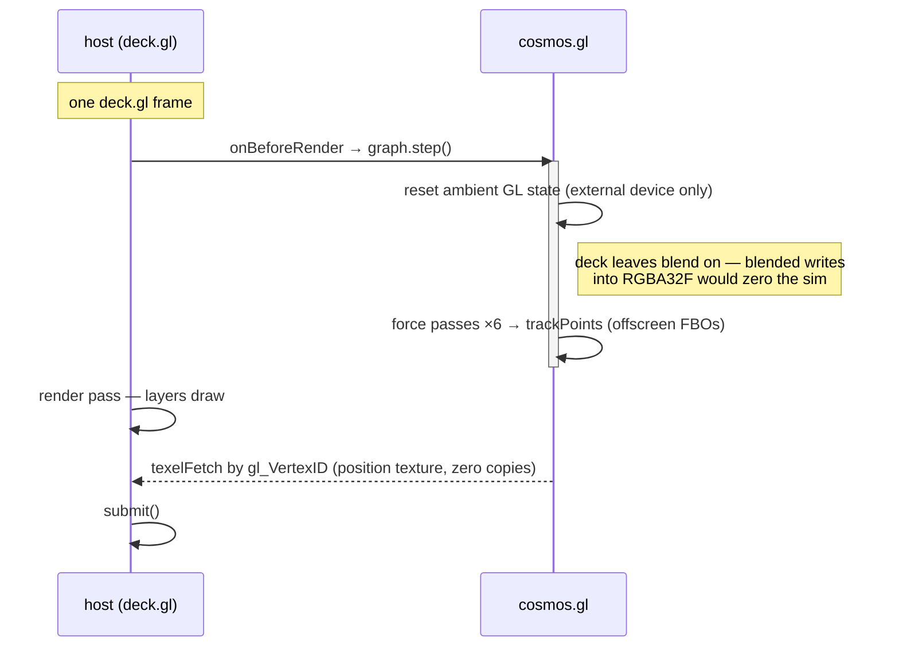
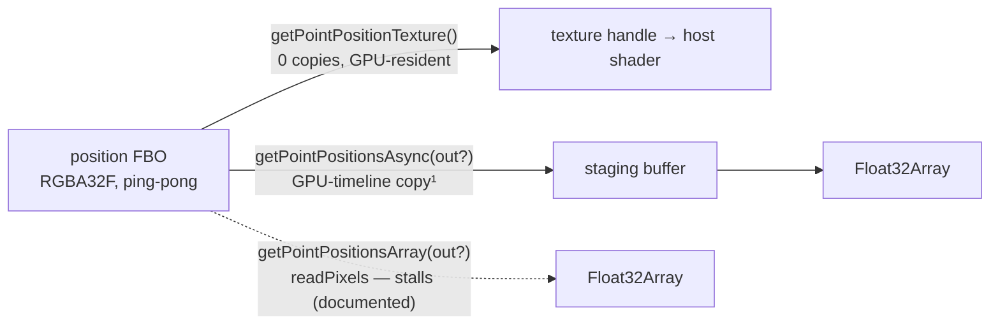
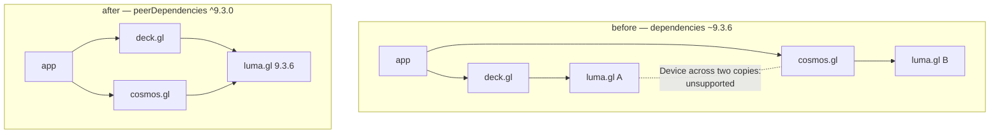

# cosmos.gl inside a host renderer

**Branch `feat/host-embedding` → cosmosgl/graph [PR #257](https://github.com/cosmosgl/graph/pull/257) · base `main` · 9 commits**

The simulation now runs headless on a host's GPU device and frame schedule, hands its
positions over at three different costs, and can render itself into the host's pass under
the host's camera — with deck.gl as the worked example.

| files | code diff | new public APIs | unit tests | stories | breaking change |
| --- | --- | --- | --- | --- | --- |
| 21 | +1,977 / −279 | 10 | 13 (real WebGL 2) | 3 (deck.gl) | 1 (luma.gl → peer) |

> A rendered version of this document with figures lives next to this file:
> [`host-embedding.html`](./host-embedding.html).

## Where this comes from

An RFC in deck.gl-community
([visgl/deck.gl-community#704](https://github.com/visgl/deck.gl-community/pull/704))
proposes a `cosmos-layers` package backed by cosmos.gl and gates a production integration
on upstream changes: a simulation that runs without owning a canvas, a render loop a host
scheduler can replace, and GPU position access that doesn't round-trip through the CPU.
This branch implements those requirements — everything the RFC proposed (the nine
upstream asks, its API sketches, its package phases, and its acceptance criteria) is
compared line by line against the delivery
[at the end of this document](#proposed-vs-implemented).

Everything is additive except the packaging change: the existing `new Graph(div, config)`
API, defaults, and rendering behavior on cosmos-owned devices are untouched.

## One Graph, three ownership modes

*`feat(graph): headless mode and external frame scheduling — cosmos runs inside a host's
frame` (`1344629`)*

The constructor now accepts `null` in place of the container element. What changes between
modes is ownership — who holds the canvas, the input, the clock, and the camera. The
engine itself is the same object with the same data APIs in all three.

| Concern | Interactive<br>`new Graph(div, cfg)` | Host-scheduled<br>`enableRenderLoop: false` | Headless<br>`new Graph(null, cfg, device?)` |
| --- | --- | --- | --- |
| Canvas & DOM | cosmos.gl | cosmos.gl | — (never adopted or reparented) |
| Pointer / zoom / drag / keys | cosmos.gl | cosmos.gl | — (no listeners installed) |
| Frame scheduling | cosmos.gl (rAF loop) | **host** — `step()` + `renderOneFrame()` | **host** — `step()` only |
| Camera / view transform | cosmos.gl (d3-zoom) | cosmos.gl (d3-zoom) | **host** — `setViewTransform()` |
| Screen draw | cosmos.gl | cosmos.gl, on host's call | **host** — own shaders or `drawToRenderPass()` |
| Device clear / submit / resize | cosmos.gl | cosmos.gl | **host** — external device never touched |
| Simulation, forces, GPU state | cosmos.gl | cosmos.gl | cosmos.gl |

Headless works with an internal device too — `new Graph(null, config)` creates a hidden
device and runs as a pure layout engine. Two behaviors follow from having no clock of
one's own: transitions **snap** instead of animating (nothing would advance them), and
view-dependent APIs are inert until the host supplies a view.

The end-of-simulation check moved with the clock. It used to live only in the render loop;
now `step()` performs it whenever no loop exists, so `onSimulationEnd` still fires exactly
once under host scheduling — the invariant "no step runs with alpha already below the
floor" holds in every mode.

## Sharing a device without inheriting its state

*`fix(graph): reset ambient GL state before passes on an external device — host blend
state zeroed the simulation` (`881ecf9`)*

Verifying the zero-copy story surfaced the one real bug of the project, and it would have
broken every shared-device embedding. luma.gl applies only the pipeline parameters a model
declares; everything else — blend, depth, scissor — is inherited from the context.
cosmos's offscreen simulation passes declare none of it, because on a cosmos-owned device
the context holds WebGL defaults. An external device arrives mid-frame carrying the
*host's* state. deck.gl leaves blending enabled, and blended writes into the RGBA32F
position textures — whose texels carry alpha 0 — zeroed the entire simulation within a few
ticks.

The fix: `resetExternalDeviceState()` restores blend, depth, scissor, stencil, cull, and
color-mask at the top of every simulation step and every rendered frame — on externally
supplied devices only. Cosmos-owned devices skip it entirely, keeping existing behavior
byte-identical.



The host calls `step()` from its own lifecycle; cosmos restores ambient GL state before
its offscreen passes, then the host's layers sample the live position texture during the
host's own pass. Cosmos never clears, submits, or resizes the device — the host alone ends
the frame.

## Positions at three costs

*`feat(points): expose GPU positions — texture handle, non-stalling snapshots, sparse
writes, per-point pinning` (`7f1213f`)*

The engine keeps positions in a square RGBA32F texture, ping-ponged between two buffers on
every GPU write. This branch makes that state readable at whichever cost the consumer can
afford:



Hosts pick a tier per use: rendering samples the texture, throttled label/export snapshots
use the async path, and the sync path remains for one-shot reads. `getPointPositions()`
keeps its `number[]` shape and now delegates to the array variant.
¹ See [open item 1](#open-items-before-undrafting): the async path's no-stall promise
needs a fence in the current luma 9.3 backend.

### The texture contract

The exported `PointPositionTexture` type pins down everything a consumer needs:

- **Layout** — square RGBA32F; point `i` lives at texel `(i % textureSize, ⌊i / textureSize⌋)`
  as `[x, y, i, unused]` in space coordinates.
- **Ownership** — the texture belongs to cosmos.gl; never write to or destroy it.
- **Ping-pong** — the handle alternates between two textures as the simulation runs, so
  identity is unstable by design. The monotonic `version` is the change signal, bumped by
  every path that can touch position state: every swap, CPU upload, transition
  interpolation frame, and sparse write. Version changed → re-fetch the handle; never
  cache the texture object.
- **Absent points** — a removed (NaN-position) point keeps its frozen last texel; consult
  the input positions to hide it.

A unit test asserts the version advances across a step.

### Sparse writes and pinning — the drag pattern, generalized

Interactive hosts need to move or pin *one* point per frame, not re-upload the world.
Three new methods write single texels into the live simulation state, exactly the way
cosmos's own pointer drag does:

```ts
// host's drag handler — one texel per call, input arrays never modified
graph.setPinnedPoint(index, true)          // pin on drag start
graph.setPointPosition(index, x, y)        // follow the pointer
graph.setPointPositionsByIndices(ids, xy)  // batched form
graph.setPinnedPoint(index, false)         // release on drag end
```

Writes target the live state like a drag: a later full data update starts from the input
positions again, absent (NaN) points are never resurrected, and a mismatched
indices/positions pair is rejected whole with a warning. While the simulation runs, forces
move the point on the next tick unless it is pinned — which is why the pair of calls above
is the drag idiom.

## Cosmos rendering under the host's camera

*`feat(graph): render into a host pass with a host camera — drawToRenderPass and
setViewTransform` (`c1752b6`)*

Zero-copy sampling means the host writes its own shaders. For hosts that want cosmos's
full pipeline instead — point shapes, per-point colors and sizes, curved per-link-colored
links, arrows — two methods let cosmos draw *inside* the host's frame:

- `drawToRenderPass(renderPass, {points?, links?})` records the point and link draws into
  a host-owned pass without clearing, ending, or submitting it. The internal renderer now
  routes through the same method, so there is one draw path, not two.
- `setViewTransform({k, x, y}, screenSize?)` injects the host's camera through the exact
  code path the interactive zoom uses, so picking, point-radius scaling, and the
  space↔screen conversions all stay consistent.

The transform contract is documented as a formula and asserted by a unit test — with
`S = spaceSize`, `[w, h] = screenSize`, a point at space position `(spaceX, spaceY)` lands
at:

```text
screenX = k · (spaceX + (w − S) / 2) + x
screenY = k · ((S − spaceY) + (h − S) / 2) + y   // cosmos space y is up; screen y is down
```

A deck.gl layer inverts this from its viewport in four lines and then calls
`drawToRenderPass` — the whole layer is ~25 lines with no custom shaders. Cosmos's visible
draw models declare their complete pipeline state, so they compose into the host's pass
regardless of what previous layers left behind.

## One luma.gl — the breaking change

*`build(deps): make luma.gl a peer dependency — one luma installation shared with the
host` (`7fdc05d`)*

A `Device` created by one copy of luma.gl and consumed by another is not a supported
boundary — the classes differ, the state trackers differ. Sharing a device therefore
requires sharing the installation, and that is a packaging fact, not a runtime one:



`@luma.gl/*` leaves `dependencies` for `peerDependencies` (`^9.3.0`). The ES build keeps
luma external — the rollup externals list now covers peers, where before the move would
have silently bundled a private copy — while the UMD/jsdelivr build stays standalone.
Verified: `npm ls @luma.gl/core` resolves a single deduped 9.3.6 for cosmos + deck.gl
9.3.10.

**Who has to act:** npm 7+ users — nobody (peers auto-install). Yarn 1 or pnpm without
auto-install-peers — add the four `@luma.gl/*` packages explicitly. CDN/UMD users —
nobody. Full instructions live in `migration-notes.md` under "Migrating to v3.5".

## Proof: three architectures, thirteen tests

*`feat(stories): deck.gl integration examples` (`ad1e651`) — `test: host-embedding unit
tests on real WebGL 2` (`313057b`)*

Each embedding architecture ships as a runnable Storybook story (Examples → Integrations)
against deck.gl ~9.3, and the API contracts are locked by a vitest browser-mode suite
running on a real WebGL 2 context in headless Chromium.

| Story | Architecture | Position path |
| --- | --- | --- |
| **Shared device, zero-copy** (10k points) | deck owns canvas, device, frame lifecycle; cosmos steps once per frame from `onBeforeRender`; two custom layers (~130 lines of GLSL + glue) draw everything | `texelFetch` on the live texture — never leaves the GPU |
| **Cosmos rendering in a deck layer** (10k points) | same shared device, but `setViewTransform` + `drawToRenderPass` reuse cosmos's own draw programs under deck's camera — ~25-line layer, no shaders | none — cosmos draws in place |
| **CPU readback layout** (2k points) | cosmos as a pure layout engine on its own hidden device; stock `ScatterplotLayer`/`LineLayer` render | throttled `getPointPositionsAsync()` snapshots |

The test suite (`npm test`, 13 passing) covers the headless lifecycle, snapshot
equivalence, the texture/version contract, sparse updates and pinning, absent-point NaN
semantics, view injection against the documented formula, external scheduling to
completion, and a regression test that enables blending on a raw shared context and proves
the simulation survives 5 steps with a pinned, sparse-moved point exactly in place. Lint
and build pass; a shared-device stress check keeps all 10,000 index channels intact across
100 interleaved steps.

## More general than a deck.gl layer

The deck.gl stories are the worked example, not the boundary — nothing in the new API
surface names deck.gl. What a given host can reach is determined by how much GPU context
it can share with cosmos, not by which library it is. That sorts the ecosystem into three
tiers:

| Tier | Coupling required | Who lands here | State |
| --- | --- | --- | --- |
| **Shared luma `Device`** (zero-copy) | Host resolves the *same* `@luma.gl` installation — the peer-dependency contract | deck.gl (this branch's stories), kepler.gl via deck, any luma.gl application | **Proven** — the only tier that is vis.gl-specific |
| **Shared raw WebGL 2 context** (zero-copy) | Host exposes its `WebGL2RenderingContext`; `luma.attachDevice({handle: gl})` wraps it and a headless Graph runs on it — the position texture then lives in the *host's* context | MapLibre GL / Mapbox GL custom layers, Three.js (`ExternalTexture`), PixiJS (WebGL), regl, raw-WebGL apps | **Mechanically supported** — luma 9.3 ships the attach path (the same one deck's interleaved Mapbox mode uses); undemonstrated, and open item 2's entry-point guards become load-bearing here |
| **Headless + snapshots** (CPU handoff) | None — positions cross as a `Float32Array` | Any renderer or framework: Cytoscape.js layout extensions, Sigma.js / Graphology, D3 apps past `d3-force` scale, React Flow auto-layout, notebooks, server-side layout precompute (the test suite already runs on SwiftShader with no screen) | **Universal today** — becomes genuinely non-blocking once the async fence lands (open item 1) |

The biggest audiences are not renderers at all but graph libraries with *pluggable
layouts* consuming the third tier as a pure layout engine — the RFC's "hidden layout
engine" pattern, generalized past its own package. Two hard bounds apply across every
tier: the simulation is 2D (`x, y` — a 3D host gains a layout plane, not a volume), and
WebGL 2 only (WebGPU-mode hosts wait on the compute backend — see "Deliberately out of
scope").

## Proposed vs. implemented

The RFC ([visgl/deck.gl-community#704](https://github.com/visgl/deck.gl-community/pull/704))
proposed in three registers: nine upstream asks (some with concrete API sketches), a
two-phase package plan with example code, and a production acceptance checklist. Each is
compared against the branch below — the summary first, then the sketches against the
shipped signatures.

| # | RFC ask | Status | How |
| --- | --- | --- | --- |
| 1 | Simulation-only class | partial | Headless `Graph(null, …)` delivers the semantics; the `GraphSimulation` class extraction is deferred until a real consumer validates the APIs |
| 2 | External frame scheduling | delivered | `enableRenderLoop: false`, `step()`, `renderOneFrame()`; no perpetual loop survives |
| 3 | Optional DOM / canvas ownership | delivered | Headless never adopts, reparents, clears, submits, or resizes; ownership rules explicit per mode |
| 4 | Read-only GPU position resource | delivered | `getPointPositionTexture()` with texel layout, ownership, ping-pong + `version` contract on the exported type |
| 5 | Host render pass | delivered | `drawToRenderPass(pass, {points?, links?})` — no clear, end, or submit; points/links separable |
| 6 | Efficient snapshots | delivered* | `Float32Array` + caller-provided `out` + async variant + documented sync stall; \*the async path still needs a fence to honor its no-stall claim (open item 1) |
| 7 | Indexed mutation and pinning | delivered | `setPointPosition`, `setPointPositionsByIndices`, `setPinnedPoint` — the RFC's proposed operations; its `setPointPinned` ships as `setPinnedPoint`, paired with `setPinnedPoints` |
| 8 | luma.gl dependency alignment | delivered | Peers at `^9.3.0`, single deduped install verified; the range deliberately excludes the luma 9.4 *prerelease* line (semver ranges don't match foreign prereleases) and will cover stable 9.4 with no cosmos release |
| 9 | Backend capability flags | not yet | Deliberately deferred (see below): the flags should describe a stabilized surface; adapters feature-detect method presence for now |

### The RFC's API sketches → the shipped signatures

Where the RFC sketched concrete code, the deliberate divergences are the interesting part:

| RFC proposed | Branch shipped | Divergence, and why |
| --- | --- | --- |
| `new GraphSimulation(device, cfg)` · `simulation.initialize()` · `simulation.step()` · `simulation.destroy()` | `new Graph(null, cfg, device?)` · `graph.render()` · `graph.step()` · `graph.destroy()` | One class, two modes, instead of a second class. Same five-call lifecycle (`initialize()` ≈ `render()`); the class extraction is deferred so a real consumer shapes the boundary before it freezes |
| "an option that disables the internal `requestAnimationFrame` loop"; host calls one sim step and optionally one render op | `enableRenderLoop: false` + `step()` + `renderOneFrame()` | Exceeds the ask: runtime-toggleable via `setConfig`, and the simulation-end check travels with the clock so `onSimulationEnd` fires under any scheduler |
| `{texture, pointCount, `**`width, height`**`, version}`; document texel format, coordinate convention, ownership, ping-pong observation | `{texture, pointCount, `**`textureSize`**`, version}` on the exported `PointPositionTexture` type | The texture is always square, so one field encodes the invariant two would obscure. Every documentation clause the RFC listed is on the type; the optional buffer form is deferred with WebGPU |
| a method recording draws into a supplied `RenderPass`; "separately configurable point and link rendering" | `drawToRenderPass(pass, {points?, links?})` — plus `setViewTransform({k, x, y}, screenSize?)` | Exact match, and the internal renderer now routes through the same method. `setViewTransform` wasn't asked for by name, but the RFC's "thin wrapper around an upstream encode(renderPass)" needs a camera — shipped with a documented, unit-tested formula |
| snapshots: `Float32Array` return; optional destination; "an asynchronous readback option where supported"; document the sync stall | `getPointPositionsArray(out?)` · `getPointPositionsAsync(out?)` · stall documented on `getPointPositions()` | All four clauses shipped in shape. The async path's no-stall behavior still needs a fence in luma 9.3 (open item 1) — the RFC's "where supported" hedge was the wiser wording until then |
| "Possible operations include `setPointPosition`, `setPointPinned`, and a batched sparse update API" | `setPointPosition(i, x, y)` · `setPinnedPoint(i, bool)` · `setPointPositionsByIndices(ids, xy)` | The proposed operations; `setPointPinned` ships as `setPinnedPoint` to pair with `setPinnedPoints`. Semantics specified beyond the ask: live-state writes on the drag path, input arrays never modified, absent points never resurrected, mismatched pairs rejected whole |
| luma: move to peers **or** publish a documented compatibility range | Both: `peerDependencies ^9.3.0`, documented in README + migration notes | The "or" became "and". The range deliberately excludes the 9.4 prerelease line and admits stable 9.4 automatically |
| capability flags for simulation, rendering, readback, external scheduling, shared resources | — | The one ask with no code: deferred until the surface the flags would describe has stabilized; adapters feature-detect for now |

### The RFC's package phases → this branch's stories

PR #257 doesn't build the deck-side package — that's deck.gl-community's work — but each
architecture the RFC describes now exists as a running prototype in the Integrations
stories:

| RFC design | Prototype in this branch | What remains deck-side |
| --- | --- | --- |
| **Phase 1: `CosmosLayout`** — hidden canvas, throttled `getPointPositions()`, `snapshotIntervalMs`, final-snapshot "calculate-then-render" mode | **CPU readback story** — headless graph on its own hidden device, 100 ms-throttled `getPointPositionsAsync(out)`, final snapshot on `onSimulationEnd`, stock `ScatterplotLayer`/`LineLayer` | Stable ID↔index mapping, `GraphLayout` lifecycle translation, topology updates, bounds. The story already upgrades the RFC's sketch from `getPointPositions()` to the reusable-destination async API |
| **Phase 2, option A** — deck-specific shaders sample the exported position resource | **Zero-copy story** — custom `CosmosPointsLayer`/`CosmosLinksLayer`, `texelFetch` by `gl_VertexID`, positions never leave the GPU | Production layer authoring: deck picking, shader modules, effects. The story is the texture-contract demo, not the layer |
| **Phase 2, option B** — "a thin wrapper around an upstream `encode(renderPass)` method" | **Cosmos-rendering story** — `setViewTransform` + `drawToRenderPass` under deck's camera; full cosmos pipeline in a ~25-line layer | Nothing to build — but these draws can't join deck's picking pass, so the RFC's "picking returns original objects" criterion pushes production toward option A. That answers the RFC's open question 3 with running code |

### The RFC's production acceptance criteria, today

Legend: **met** — demonstrated by this branch · **grounded** — supported, formal test
pending · **deck-side** — the integrating package's work · **deferred** — explicitly
future work.

| Criterion | Status | Evidence |
| --- | --- | --- |
| Steady-state animation performs no full position readback | met | Zero-copy story: positions sampled in place across the whole run |
| Only one canvas and one luma.gl device | met | Both shared-device stories; the readback story keeps a hidden device by design (Phase-1 pattern — it could now share too) |
| No independent animation loop, clear pass, or device submission | met | Headless guarantees it structurally; a unit test asserts the external device survives `destroy()` |
| Layer ordered between deck layers corrupts neither draw | grounded | Full-pipeline-state draw models + the GL-state reset + the 100-step stress check; a formal before/after-layer render test belongs to the package |
| Picking returns the original node/edge object and stable ID | deck-side | Cosmos ships the primitives (`setPinnedPoint`, `setPointPosition`); host-native picking is the adapter's job |
| Changing view state does not restart the simulation | met | All three stories: pan/zoom redraws from the live texture without touching alpha |
| Removing the layer releases all adapter-owned resources | grounded | Both shared-device stories tear down cleanly; the readback story currently leaks its graph (open item 4) |
| Benchmarks vs `D3ForceLayout` and the readback prototype at 10k–250k points | deferred | Future work: "the stories prove the architectures; the numbers deserve a dedicated perf story" |

**Shipped beyond the proposal:** the ambient GL-state reset (the RFC never anticipated
host state leaking into cosmos's offscreen passes — the one real bug, found, fixed, and
regression-tested), the position `version` counter's per-write granularity, runtime
toggling of the render loop, absent-point NaN semantics across every new API, and a
13-test WebGL 2 suite on cosmos's own side — the RFC asked for tests only in the
downstream package.

## Deliberately out of scope

From the PR author's future-work comment, in dependency order:

- **Awaiting a real consumer** — the `GraphSimulation` class extraction (headless `Graph`
  is functionally equivalent; extracting first risks freezing the wrong boundary),
  capability flags (trivial, but they should describe a stabilized surface), and formal
  readback-vs-zero-copy benchmarks with GPU timer queries.
- **Blocked on upstream** — luma.gl 9.4 (the peer range intentionally skips the prerelease
  line and admits stable 9.4 automatically) and WebGPU / compute-only devices (the
  simulation is WebGL 2 fragment shaders over ping-pong FBOs throughout; a WebGPU backend
  is a compute rewrite plus a WGSL port).
- **The integrating side's work** — a published adapter package, host-native picking that
  returns original application objects, and node dragging built on that picking; the
  cosmos-side primitives for it (`setPinnedPoint`, `setPointPosition`) ship here.

Two earlier open questions were resolved in-branch: cosmos-side unit tests were added
(`313057b`, with the GL-state regression test confirmed to fail when the fix is disabled),
and a suspected `drawToRenderPass` depth-state rough edge turned out not to exist — every
visible draw model already declares its depth state, and a redundant story-side override
was removed (`ba7afa5`).

## Open items before undrafting

A deep review of the branch confirmed the architecture and contracts above and left five
items, in severity order:

1. **The async snapshot still stalls.** The enqueue half is right —
   `copyTextureToBuffer` records a GPU-timeline `readPixels`-into-PBO copy — but luma
   9.3's WebGL `Buffer.readAsync` is a synchronous `getBufferSubData` in disguise, and
   calling it immediately forces the driver to drain every queued command the copy
   depends on: the whole simulation tick. Net effect: the "async" path synchronizes at
   the same point as the sync path, despite its documented no-stall contract —
   negligible in the 2k-point story, main-thread jank at the 100k+ scale cosmos exists
   for, and a silent skew in the RFC's planned readback-vs-zero-copy benchmarks. The fix
   is one fence, shipped in the same luma version: `device.createFence()` after submit,
   `await fence.signaled` (a non-blocking `clientWaitSync` poll), then read — plus
   capturing `pointsNumber`/`textureSize` at call time, since a real async gap lets data
   updates land mid-flight. The API shape itself is forward-correct (a WebGPU backend
   satisfies it natively via `mapAsync`); until the fence lands, the honest wording is
   the RFC's own "asynchronous readback *where supported*."
2. **The GL-state reset guards two entry points, not all of them.** `trackPoints()` is a
   raster draw reachable outside the guarded step/frame paths — through the new
   `setPointPositionsByIndices`, through `trackPointPositionsByIndices`, and through
   `render()` — so a shared-device host using point tracking can still hit the
   blend-corruption class the branch fixes. The corruption *persists* once the simulation
   has settled (no guarded step runs afterward to repair it — and a settled layout is
   exactly when users drag), and the regression test walks past this door: it never
   enables tracking, so `trackPoints()` early-returns. Cheap fix: reset at those public
   entries too (a no-op on cosmos-owned devices).
3. **`npm test` runs in no CI and needs an undocumented `npx playwright install`.** Out of
   the box the suite fails with a missing-browser error; after the one-time install, 13/13
   pass in ~6.5s. Add a CI step and one line in the contributor docs.
4. **The readback story leaks its graph.** Its `destroy()` finalizes deck but never calls
   `graph.destroy()`, leaking a hidden WebGL context per story switch — and browsers cap
   live contexts (~16), so flipping stories eventually evicts the oldest, possibly the
   one on screen. The other two stories tear down correctly; the fix is one line.
5. **Small alignments.** Pinning now documents the declarative contract (an index beyond
   the point count pins its point once the count grows — the tracking API's contract),
   drops entries that can never name a point, and exposes per-point state through
   `isPointPinned`. The migration heading says v3.5 while the
   package is 3.4.1 and the change is labeled breaking; and the reset reaches luma through
   optional-chained `setParametersWebGL?.`, which would degrade silently if a future luma
   renames it. The peer range admits stable 9.4 automatically the day it ships — worth a
   CI leg against 9.4 when it stabilizes, since the cosmos-layers work targets that line.

---

**Pointers.** Implementation: cosmosgl/graph
[PR #257](https://github.com/cosmosgl/graph/pull/257) (`feat/host-embedding`, 9 commits,
draft) and its future-work comment. Motivating RFC: visgl/deck.gl-community
[PR #704](https://github.com/visgl/deck.gl-community/pull/704)
(`docs/rfcs/cosmos-layers.md`). Rationale log:
`history/2026/2026-08-18-host-embedding.md`. Migration: `migration-notes.md` → "Migrating
to v3.5". Stories: Storybook → Examples → Integrations.
