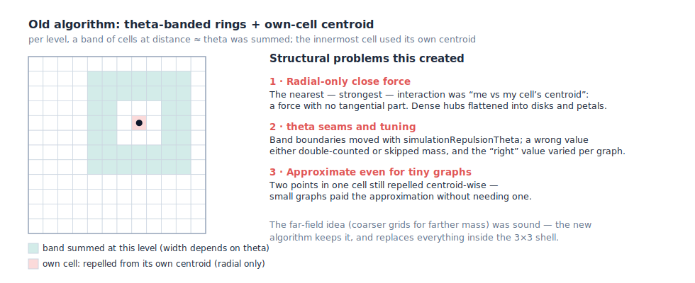
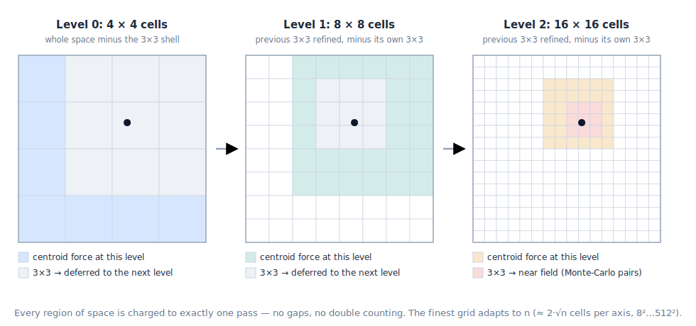
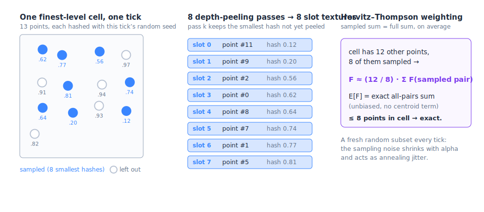
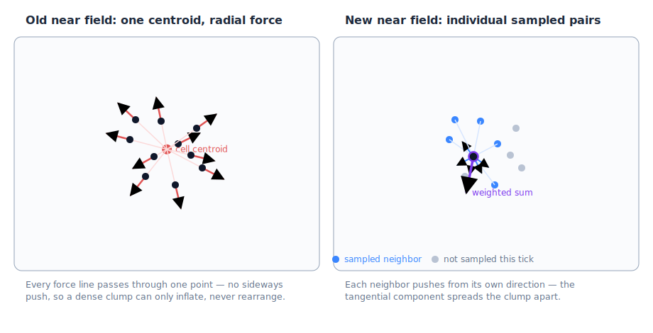
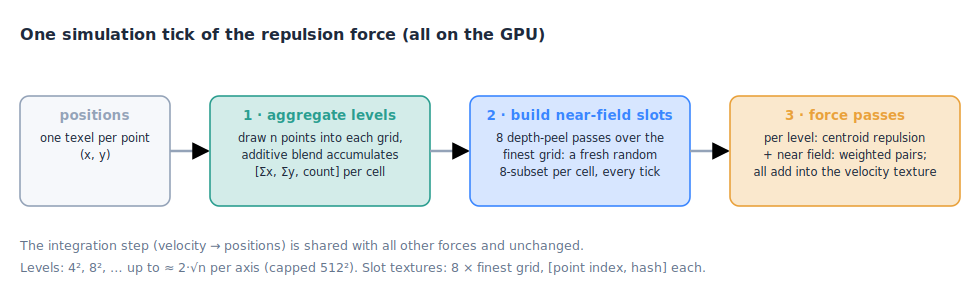

# The many-body repulsion algorithm: grid pyramid + Monte-Carlo near field

This is a walkthrough of the repulsion force introduced in
[#240](https://github.com/cosmosgl/graph/pull/240) — what the old algorithm did, what the new
one does instead, and why the change matters. The code lives in
`src/modules/ForceManyBody/`; the short engineering record is
`history/2026/2026-07-08-many-body-repulsion.md`.

## The problem both algorithms solve

Repulsion is an *n-body* force: every point pushes away every other point. Computed literally
that is n² pairs — at 100 000 points, ten billion pair evaluations *per simulation tick*. No
GPU does that at 60 fps, so every practical layout engine approximates: **distant mass may be
lumped together, close mass may not.** A point cares whether its neighbor is 3 or 5 units away;
it does not care whether a blob on the far side of the graph is at 4000 or 4002.

Both the old and the new algorithm follow that principle. They differ in *how* they lump the
far mass, and — decisively — in what they do up close.

## How the old algorithm worked



The old code (`force-centermass.frag` + the old `force-level.frag`, still visible on `main`)
built a stack of grids over the space, each holding per-cell aggregates
`[Σx, Σy, count]` — a cell's **centroid** (center of mass) is `Σ/count`. Then, per point:

1. **Far field:** at each level, a *band* of cells — a ring whose width and position depended
   on the `simulationRepulsionTheta` parameter — was summed centroid-wise. Coarser levels
   handled farther rings.
2. **Near field:** at the deepest level, the point was repelled from **its own cell's
   centroid** — one force, from one averaged position.

This worked, but had three structural problems:

1. **The close force was purely radial.** The strongest interactions a point has are with its
   nearest neighbors, and the old code compressed all of them into a single centroid. A force
   from a centroid always points along the line through the centroid — there is *no tangential
   component*. A dense clump can inflate, but its points can never slide sideways past each
   other to rearrange. That is exactly the artifact you could see on dense hubs: they collapsed
   into flat disks and petal shapes instead of spreading into clouds.
2. **`theta` was a footgun.** The band boundaries moved with `simulationRepulsionTheta`. A
   wrong value either double-counted mass (over-repulsion) or skipped mass (holes in the
   force), and the right value depended on the graph. Users had to tune a parameter that only
   existed to patch the approximation's seams.
3. **Small graphs paid for an approximation they didn't need.** Two points sharing a cell
   repelled each other centroid-wise even when the whole graph had 500 points and exact forces
   would have been trivial.

## The new algorithm in one sentence

Keep the sound part — **coarser grids for farther mass** — but make the decomposition seam-free
(no `theta`), and replace the centroid near field with an **unbiased random sample of real
pairwise forces**, so close points repel each other *individually*.

The scheme is known in physics simulation as **P3M** (particle–particle / particle–mesh): a
mesh handles the far field, true particle–particle forces handle the near field. The same idea
already powers the 3D force on the `feat/3d` branch; #240 ports it back to 2D.

### Step 1 — aggregate the grid pyramid

Same raw material as before: a pyramid of grids at 4², 8², 16², … resolution, up to an adaptive
finest level of about **2·√n cells per axis** (floored at 8², capped at 512²). Each tick, every
point is drawn into each grid as a 1-pixel point with additive blending, accumulating
`[Σx, Σy, count]` per cell (`calculate-level.vert/frag`).

The 2·√n target means an *average of ¼ point per finest cell* — most cells are empty or hold
one point. Keep that in mind for step 3.

### Step 2 — the pyramid tiles space exactly once



The `theta` bands are gone. Instead there is one fixed, resolution-independent rule
(`force-level.frag`):

- The **coarsest level** applies centroid repulsion from *every* cell except the 3×3
  neighborhood around the point's cell.
- Each **finer level** takes over exactly that deferred 3×3 — which at double resolution is its
  aligned **6×6 child block** — and applies centroid forces there, again minus its *own* 3×3.
- After the finest level, the only region not yet accounted for is the finest 3×3 neighborhood.
  That is the **near field**, and it is the only part where the centroid trick would do damage
  (up close, direction errors matter). It gets step 3 instead.

Every cell of space is charged to exactly one pass: **no gaps, no double counting, nothing to
tune.** Far-field centroid error is negligible by construction, because a cell is only ever
used at a distance at least ~1 cell away from its own size scale.

### Step 3 — the Monte-Carlo near field

This is the heart of the change. The exact near-field force on a point is the sum of pairwise
forces from every other point in the 3×3 finest-cell neighborhood. Computing all of them is
O(occupancy²) per point — fine for sparse cells, fatal for a 1000-point hub cell. The new code
computes an **unbiased estimate** instead:



**Sampling (`build-nearfield-slots.vert`):** every tick, each point gets a fresh pseudo-random
hash. Eight "depth peeling" passes then run over the finest grid; pass *k* selects, per cell,
the point with the smallest hash *not yet selected by passes 0..k−1* (the GPU depth test does
the per-cell minimum for free). After 8 passes, each cell's 8 **slot textures** hold a uniform
random 8-subset of its points — re-drawn from scratch every tick.

**The hash must be an integer hash.** The first version used the classic
`fract(sin(index * 12.9898 + seed * 78.233) * 43758.5453)` one-liner, which is quietly broken at
this engine's scale: with hundreds of thousands of points the `sin()` argument reaches millions
of radians, where GLSL guarantees no accuracy and real GPUs diverge — [testing across
vendors](https://github.com/danilw/GPU-sin-hash-stability) shows sin-hashes produce different
(and sometimes visibly broken) values on NVIDIA vs AMD vs Apple vs mobile. Degraded precision
means correlated or *colliding* hashes, and a collision is not cosmetic here: the peeling
eligibility test (`hash <= previous slot's hash`) silently skips a tied point, so it can never
be sampled and the Horvitz–Thompson estimate loses its unbiasedness. The replacement is
**lowbias32**, an XOR-shift–multiply integer hash that sits on the quality/speed Pareto
frontier of [Jarzynski & Olano's GPU-hash study
(JCGT 2020)](https://www.jcgt.org/published/0009/03/02/paper.pdf) with the [lowest measured
bias of its class](https://fgarlin.com/blog/gpu-rng/). Integer ops are exact on every GPU, and
both inputs are exact (the point index is an integer-valued float; the per-tick seed enters via
`floatBitsToUint`), so the ordering is identical across platforms. Only the hash's top 24 bits
become the float ticket, so the value written to the slot texture round-trips bit-exactly into
the next pass's comparison. Cost is a wash: ~8 integer ALU ops replace a special-function-unit
`sin()`, in a pass dominated by texture fetches anyway.

**Estimation (`force-nearfield.frag`):** for each of the 9 neighborhood cells, the point sums
the true pairwise forces from the sampled slots (skipping itself), then scales the sum by

```
others / sampled        // e.g. cell holds 12 other points, 8 sampled → × 12/8
```

This is the **Horvitz–Thompson estimator**: since each of the cell's `others` points had equal
probability `sampled/others` of being in the sample, dividing by that probability makes the
*expected value* of the estimate equal the exact all-pairs sum. Unbiased — and with **no
centroid term**, so the tangential force component survives:



Two properties fall out for free:

- **Sparse cells are exact.** A cell with ≤ 8 points is sampled exhaustively
  (`others == sampled`, weight = 1). With the finest grid at 2·√n per axis, the average cell
  holds ¼ point — so for typical graphs the near field *is* the exact all-pairs force, and the
  approximation only kicks in inside genuinely dense hubs. This is also why the prototyped
  separate brute-force path for small graphs was dropped: the grid path is already effectively
  exact there, and faster.
- **The sampling noise is a feature.** The estimate is unbiased but noisy, and the noise is
  re-rolled every tick. Because every force is scaled by `alpha`, the noise *anneals*: large
  early, when clumps need breaking apart, shrinking to nothing as the layout settles. It is
  precisely the jitter that lets stacked points find distinct directions to escape along.

### Step 4 — two stability guards

Both live in `force-nearfield.frag`, both born from real failure modes:

- **Coincident points get a random kick.** Two points at *exactly* the same position have no
  separation direction — an inverse-distance force is undefined, so they would stay stacked
  forever, while their combined cell count repels everything else away, carving an empty "void
  ring" around the stack. Instead, each point kicks along its own per-point random vector, so a
  pile disperses.
- **Per-tick velocity clamp (2 × cell size).** The `others/sampled` weight is unbiased but
  high-variance: in a cell holding far more points than 8 slots, a couple of very close samples
  can be multiplied into a huge one-tick kick — flinging points across the screen at startup
  and ejecting points from dense cluster centers. The clamp caps the magnitude and keeps the
  direction; genuine spreading kicks are far below the bound, and bulk expansion is driven by
  the far-field levels anyway.

### The per-tick pipeline



Orchestrated by `src/modules/ForceManyBody/index.ts`:
`drawLevels()` → `drawNearFieldSlots()` → `drawForces()` (per-level force passes plus the
near-field pass, all blending additively into the shared velocity texture). Integration into
positions is the same step every other force uses.

## Why it is better than the old one

| | Old (theta-banded quadtree) | New (grid + Monte-Carlo near field) |
|---|---|---|
| Close-range force | own-cell centroid — radial only | sampled real pairs — full direction |
| Dense hubs | collapse into disks / petals | spread into natural clouds |
| Stacked points | never separate (void rings) | random kick disperses them |
| Coverage seams | depend on `theta` tuning | exact once-tiling, nothing to tune |
| Small / sparse graphs | always approximate | effectively **exact** (cells ≤ 8 points) |
| Bias | systematic (centroid direction) | none — unbiased estimator; noise anneals with alpha |
| `simulationRepulsionTheta` | required tuning | deprecated no-op (accepted, ignored) |
| Speed | baseline | **~1.2–4× faster per step** across the practical range |
| Code paths | one, plus the theta special-casing | one, for every graph size |

The speedup comes from the fixed 3×3/6×6 loop structure (compact, coherent texel fetches;
no data-dependent band walking) — measure it yourself with the **Misc → Repulsion Benchmark**
story, which steps the simulation directly and forces a readback so the numbers aren't capped
by the display refresh rate. The before/after videos in the
[PR description](https://github.com/cosmosgl/graph/pull/240) show the visual difference on a
dense-hub graph.

## The trade, honestly

The old algorithm's error was a systematic *bias* — invisible per-frame, but it deformed
layouts (disks, petals, void rings) and never went away. The new algorithm's error is
*variance* — visible as per-tick jitter in dense regions while `alpha` is high, but centered on
the exact answer and vanishing as the simulation cools. For a layout engine that trade is
clearly right: the final layout is what users keep, and the transient jitter is doing useful
work (annealing) on the way there.

Cost side: 8 extra slot textures at the finest grid resolution (at the 512² cap that is
8 × 512² × 2 floats = 16 MB of GPU memory) and the 8 peeling passes per tick — both already
included in the benchmark numbers above.

## Glossary

- **Barnes-Hut** — the classic n-body approximation: treat a far-away group of points as one
  point at their center of mass. Both algorithms use this for the far field.
- **P3M (particle–particle / particle–mesh)** — hybrid scheme: mesh (grid centroids) for far
  interactions, direct particle pairs for near ones. The new algorithm is a P3M with a
  Monte-Carlo particle–particle term.
- **Depth peeling** — running the same draw repeatedly, each pass "peeling off" the previous
  winner of the depth test to reveal the next one. Used here to extract the K smallest-hash
  points per cell, one per pass.
- **Horvitz–Thompson estimator** — weight each sampled item by the inverse of its inclusion
  probability; the weighted sample sum is then an unbiased estimate of the full-population sum.
- **Chebyshev distance** — `max(|Δx|, |Δy|)`; "Chebyshev ≤ 1" is the 3×3 neighborhood.
